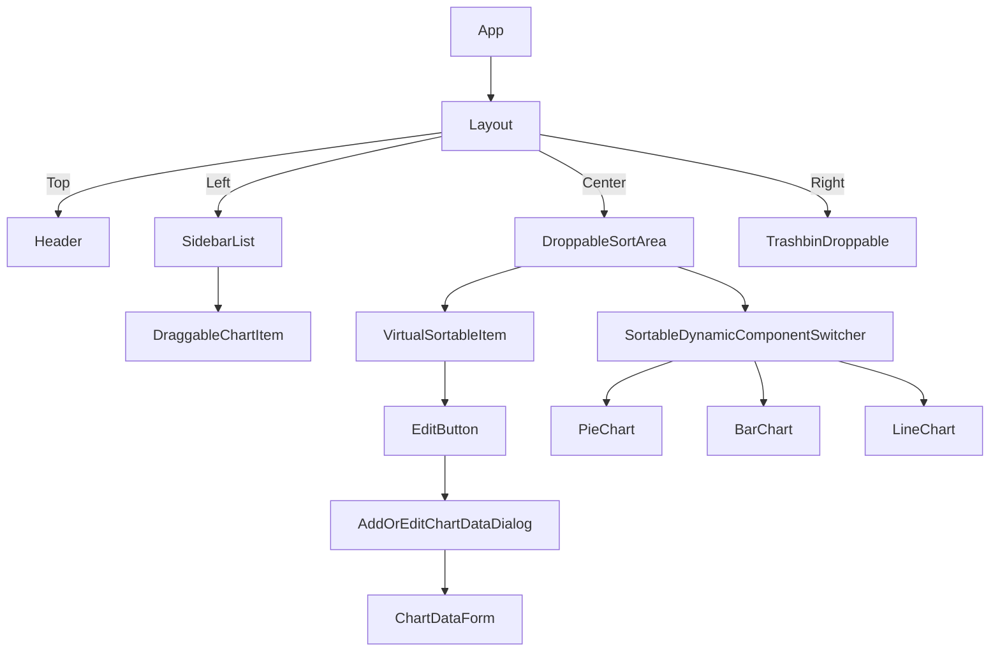
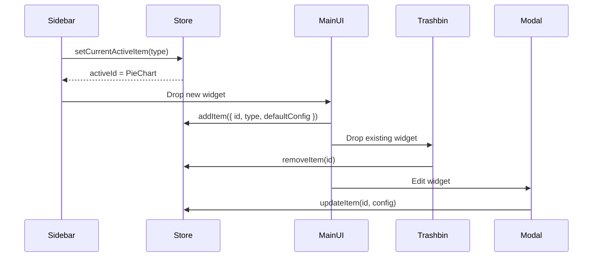

# 📊 Modular Widget-Based Dashboard

[](https://modular-widget-dashboard.vercel.app)
[](https://github.com/sandeep-stha/modular-widget-dashboard)

A scalable, dynamic dashboard built with **React**, **TypeScript**, **DnDKit**, **react-window** and **Zustand**. Users can drag widgets (charts, graphs, etc.) from the sidebar, customize them, reorder them, and remove them via a trash bin — all persisted in localStorage.

---

## 📺 Live Demo

🔗 **[modular-widget-dashboard.vercel.app](https://modular-widget-dashboard.vercel.app)**  
📁 **[GitHub Repository](https://github.com/sandeep-stha/modular-widget-dashboard)**

---

## ✨ Features

- 🧩 Drag & Drop widgets from sidebar to dashboard
- 🔁 Sortable and re-orderable grid
- 🗑️ Drop into trash bin to remove
- 🧠 Persist state using Zustand + cookies
- 🎨 Edit color and data via modal
- 🌗 Light/Dark theme switcher
- ⚡ Virtualized dashboard list (`react-window`)
- 🔧 Easily extensible widget architecture
- 🔐 Secured Devtools

---

## 📂 Project Structure

```
src/
├── pages/
│   └── App.tsx                  # Root app layout
├── shared/
│   ├── components/              # Widgets, dynamic switchers
│   ├── layouts/                 # Navbar, sidebar, main canvas
│   ├── stores/                  # Zustand store (with persist)
│   ├── hooks/                   # Theme toggle, disable devtools
│   ├── constants/               # Chart config options
│   ├── enums/                   # DnD zones and themes
│   └── utils/                   # UUID, default config utilities
└── components/ui/               # UI components (from Shadcn)
```

---

## 🧠 Architecture Overview



---

## 🔁 Data Flow



---

## 🧩 Adding a New Widget Type

To add a new widget (e.g., DoughnutChart):

1. **Create Component**  
   `/shared/components/Charts/DoughnutChart.tsx`

2. **Register it**  
   `/shared/constants/dashboardChartComponentList.ts`

3. **Add default config**  
   `/shared/constants/defaultChartConfig.ts`

4. **Add to switcher**  
   `SortableDynamicComponentSwitcher.tsx`

---

## ⚙️ Technologies Used

| Area             | Tool/Library           |
| ---------------- | ---------------------- |
| Framework        | React + TypeScript     |
| State            | Zustand + Persist      |
| Drag & Drop      | DnDKit                 |
| Virtualization   | react-window           |
| Theming          | Custom Tailwind + Hook |
| Charting         | Recharts               |
| UI               | Shadcn + Chakra        |
| Form & Schema    | react-hook-form + zod  |
| Devtools Control | disable-devtool        |

---

## ⏱️ Complexity Analysis

| Operation           | Time Complexity                                   |
| ------------------- | ------------------------------------------------- |
| Add Widget          | O(1)                                              |
| Remove Widget       | O(n)                                              |
| Reorder Widget      | O(n)                                              |
| Render Entire Grid  | O(n)                                              |
| Render Visible Area | O(k) where k = visible items (via `react-window`) |

✅ Efficient even with 50+ widgets due to virtualization.

---

## 🧪 Dev & Tooling

- 🧼 ESLint + Prettier
- ✅ Conventional commits
- 🧪 Test-ready with Playwright
- 🔍 Git hooks via Husky

---

## 🚀 Future Improvements

- 📐 Resizable grid layout (`react-grid-layout`)
- 📋 Export/import layout configs
- ☁️ Remote persistence via Supabase or Firebase
- 🧾 Add table widgets and other components
- 🔍 Grid snapping, resize handles, tabbed dashboards

---

## 🚧 Local Setup

```bash
git clone https://github.com/sandeep-stha/modular-widget-dashboard
cd modular-widget-dashboard
bun install
bun run dev
```

---

## 🧠 Author

**Sandeep Shrestha**  
🔗 [GitHub](https://github.com/sandeep-stha)  
🔗 [Live Site](https://modular-widget-dashboard.vercel.app)

---

## 📝 License

MIT License © 2025 [Sandeep Shrestha](https://github.com/sandeep-stha)
